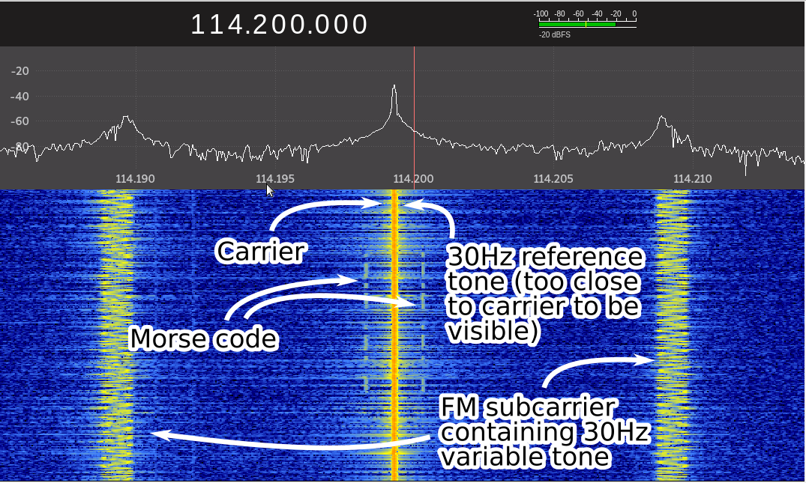
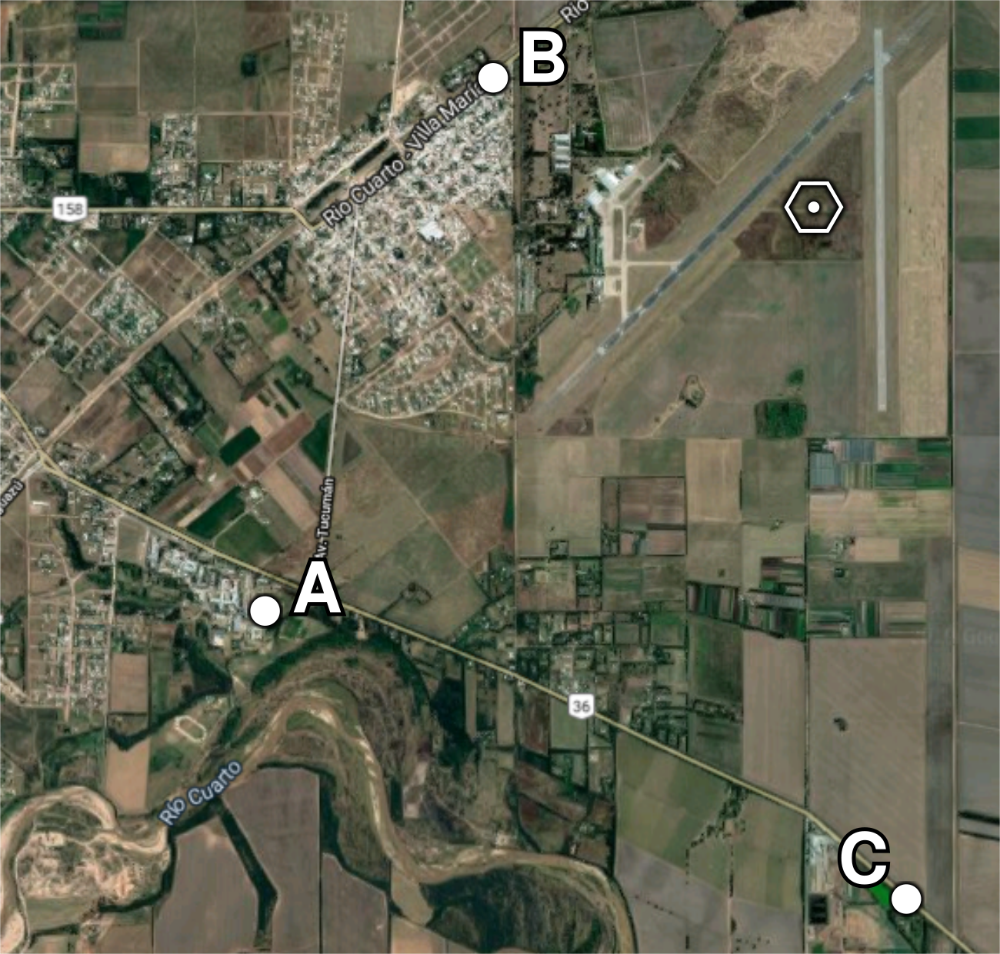

# vor-python-decoder

Determines the bearing to your position from a
[VOR](https://en.wikipedia.org/wiki/VHF_omnidirectional_range) antenna. You can
use a RTL-SDR with a dipole.

Uses Python3, numpy, scipy and matplotlib.

After a little tuning we were able to determine our bearing with less than 3° of
error.

This was made in a hurry as a final project, so do not expect a reliable
real-time decoder. On the other hand, We think the code is really simple if you
are a numpy/scipy/python guy, other alternatives we found were made on
[GNU-Radio](http://www.housedillon.com/posts/vors-and-sdrs-part-3-supplemental-materials/),
[GNU-Radio](https://www.rtl-sdr.com/using-an-rtl-sdr-to-decode-vor-aircraft-navigation-beacons-in-real-time/)
or
[C](https://www.rtl-sdr.com/an-open-source-vor-receiver-for-airspy-and-rtl-sdr/)
instead.

**En la carpeta `/docs` hay un informe y una presentación en español**

Made by Martín Bernardi, Augusto Remedi and Ignacio Rittano.

## Note

Probably you will need to measure your bearing from a known location first and
change `ANGLE_OFFSET = 114` to another value. Once you tune that value you
should get accurate results. See more information on
[this section](#filter-delays).

## Usage

First determine the frequency of the VOR antenna and tune your SDR. You should
use AM demodulation and make the bandwidth wide enough so both sidebands can fit
into the filter.

You will hear a morse code identifying the station every few seconds and a
permanent high frequency hiss
([Example](https://github.com/martinber/vor-python-decoder/blob/master/samples/293deg_long_1.wav)).

The program takes as an input a recording of this demodulated AM audio as a WAV
file:

```
./decoder.py ./recording.wav
```

It will print on your terminal the bearing to your location.

It makes no sense to use recordings longer than 1 second. In the `/samples`
folder there are some examples, each filename has the bearing to where they were
recorded, measured using a map.

## How it works



As far we are concerned, you can assume that the transmitter sends two 30Hz
tones, we name them REF (reference) and VAR (variable) signals. The REF tone is
modulated in AM, together with the morse code.

On the other hand, the VAR signal is present on a FM subcarrier. So you need to
first demodulate the AM carrier (obtaining REF and morse) and then isolate the
FM subcarrier to make a second demodulation. The end result is the 30Hz VAR
tone.

By comparing the phase difference between the REF and VAR tones you can
directly determine your bearing.

On practice, things are a little harder, for example you have CVOR (Conventional
VOR) and DVOR (Doppler VOR) with some differences. This program should work at
least with CVOR beacons.

The AM demodulation is already done by GQRX or SDR#, so the steps performed
by this program are:

- Uses a lowpass filter with a cutoff of around 500Hz to get the REF signal.

- Demodulates the FM subcarrier to get the VAR signal.

  - First uses a bandpass filter to isolate the FM signal at 9.96kHz.

  - Does the product against a 9.96Hz complex exponential to center the FM
    signal on 0Hz. During this step we get a complex quadrature signal.

  - The FM demodulation is made by looking at the angle of the complex signals
    we got on the previous step.
    [More information](https://witestlab.poly.edu/blog/capture-and-decode-fm-radio/)

- Does the cross correlation between both signals to determine the phase
  difference between the two. The phase difference is the bearing to your
  position.

You can edit the program and set `PLOT_STEPS` to `True` to plot the spectrum of
the steps performed.

### Filter delays

It is very important to take into account the delay of each filter before
comparing the phase difference between both signals. We used FIR filters which
produce a delay of (N-1)/2 where N is the number of taps. For this reason we
store in a variable the delay that every filter produces, so in the end, just
before comparing, we align both signals.

However, there is a problem with this program, on our tests the result is
always 114° off. We think that the problem may be that we are not taking into
account some delay produced by the FM demodulation.

Anyways, we just add an additional 114° delay. This gives us consistent results
on every recording we made.

## Our results

We made some short recordings on different locations around a the [TRC VOR
beacon](https://ourairports.com/navaids/TRC/Rio_Cuarto_VOR_AR/).



[KMZ of these points](./docs/vor_tests.kmz)

After determining the 114° value mentioned earlier, every measurement was
within +/-3°:

- Point A: 235.8°, looking at the map should be around 234°
- Point B: 291.6°, looking at the map should be around 293°
- Point C: 178.2°, looking at the map should be around 177°

## Screenshots

Receiving with GQRX:


WAV recording (after the demodulation made by GQRX):


Signal after using a bandpass filter to isolate the FM subcarrier:


Signal after doing the product against a complex exponential to center the FM
subcarrier on 0Hz:


Decimation of the previous step:


Not showing images of the spectrum of the FM demodulation (VAR signal) or the
spectrum of the lowpass filter on the input signal (REF signal). But you can see
both signals on the following image, which compares the phase between the two.


