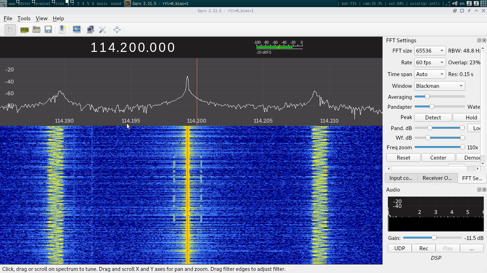
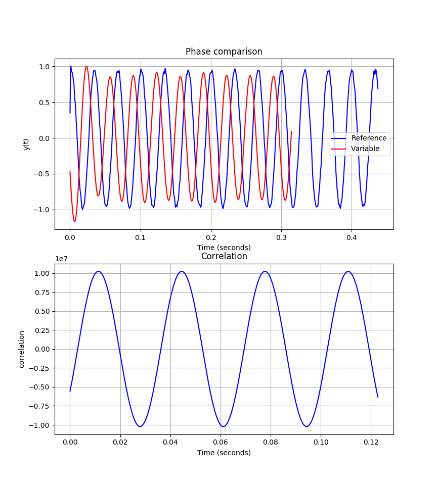
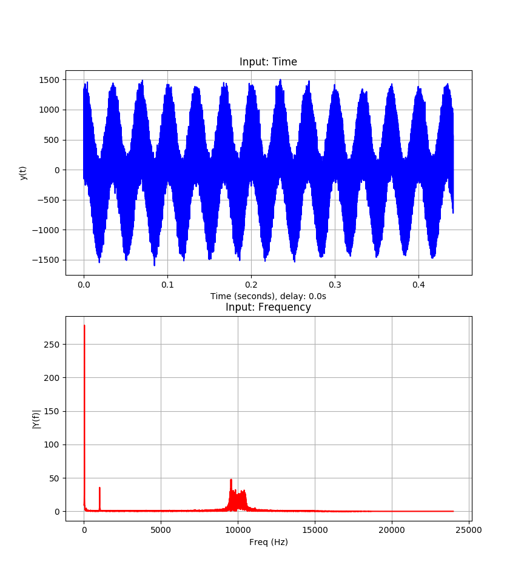
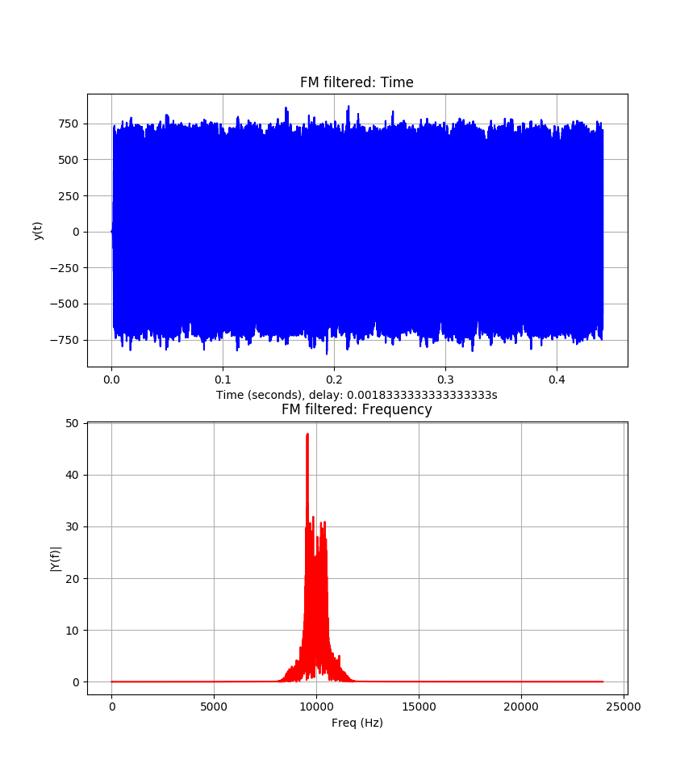
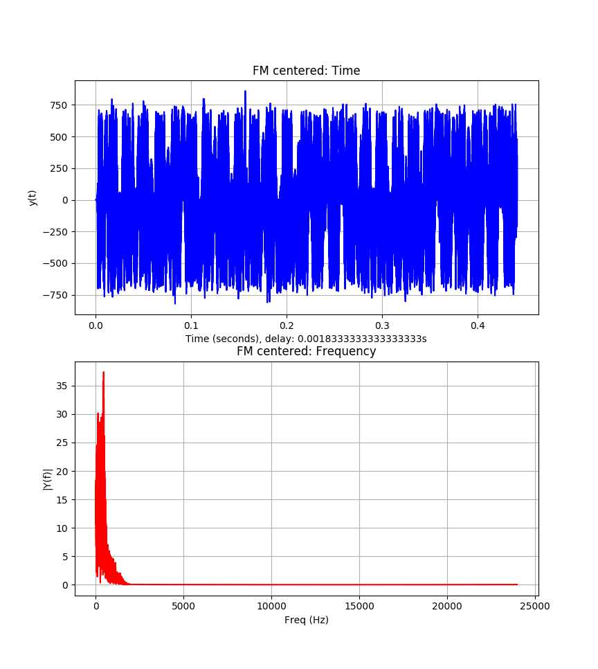
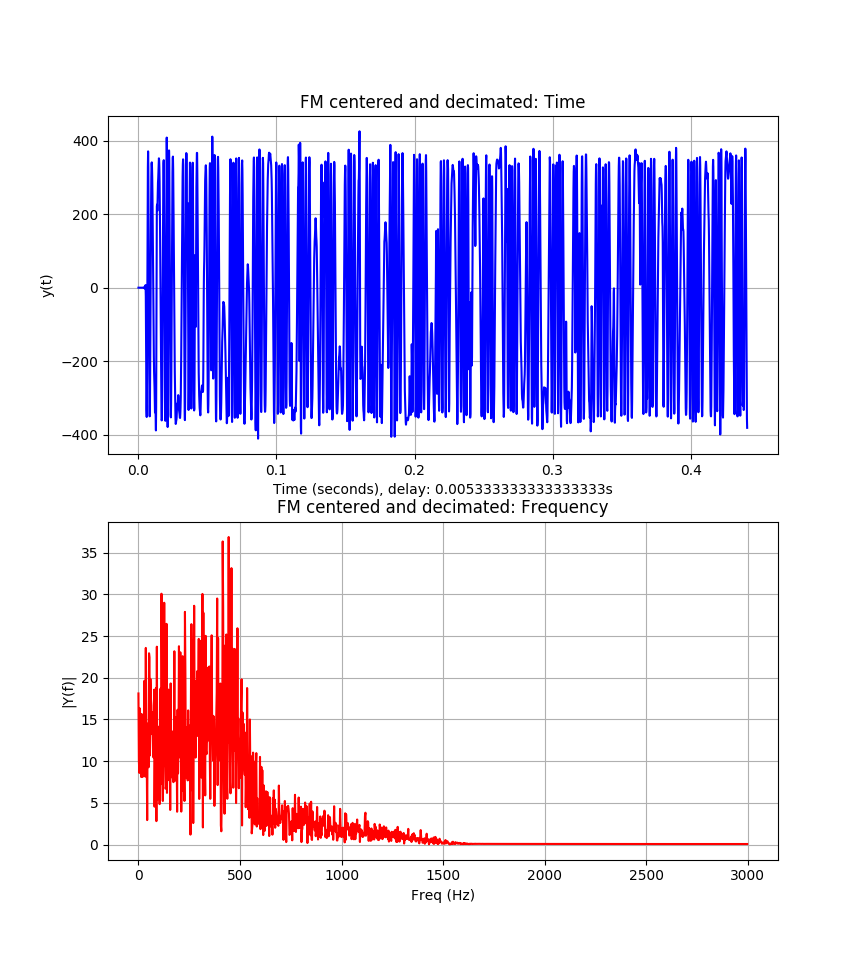

# vor-python-decoder

Determines the bearing to your position from a
[VOR](https://en.wikipedia.org/wiki/VHF_omnidirectional_range) antenna. You can
use a RTL-SDR with a dipole.

Uses Python3, numpy, scipy and matplotlib.

## Note

There is a problem with this program, on my recordings the result is always 110°
off, so I just add that constant after doing the calculations.

Probably you will need to measure your bearing from a known location first and
change `ANGLE_OFFSET = 110` to another value if necessary.

## Usage

First determine the frequency of the VOR antenna and tune your SDR. You should
use AM demodulation and make the bandwidth wide enough so both sidebands can fit
into the filter.

The program takes as an input a recording of the demodulated AM audio as a WAV
file:

```
./decoder.py ./recording.wav
```

It will print at the end the bearing to your location.

It makes no sense to use recordings longer than 1 second. In the `/samples`
folder there are some recordings, each filename has the bearing to where they
were recorded, measured using a map.

You can edit the program and set `PLOT_STEPS` to `True` to plot the spectrum of
the steps performed.

## How it works

The steps performed
by the program are:

- Filters the 30Hz tone, as it is the "reference" signal

- Demodulates the FM subcarrier to get the "variable" signal

- Does the cross correlation between both signals to determine the phase
  difference between the two. The phase difference is the bearing to your
  position

## Screenshots

Receiving with GQRX:




Comparison between reference and variable signals:



Images of various steps of the demodulation:








